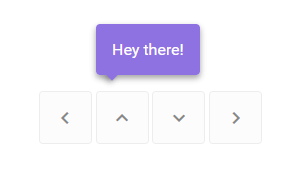

# float

A JS library for creating configurable overlays.



## API

`float(config: Config).show();`

```
interface Config {
  positionStrategy: PositionStrategy;
  template: HTMLElement;
  attachTo: HTMLElement;
  parent?: HTMLElement;
  hasBackdrop?: boolean;
  closeOnBackdropClick?: boolean;
  backdropColor?: string;
  arrowStrategy?: ArrowStrategy;
  transition?: Transition;
  customCss?: string;
}
```

## floaters

Pre-configured floaters, position strategies and arrow strategies.

```
floaters.positionStrategies.ninja(
    'TOP_LEFT',
    {
        x: 0,
        y: -12
    },
    false,
    true
);
```

`floaters.ufo( document.querySelector("#attachTo"), 'hello' );`

# ToDo

- move class from main to separate file
- scss with webpack (import \* as styles from './xxx.scsss')
